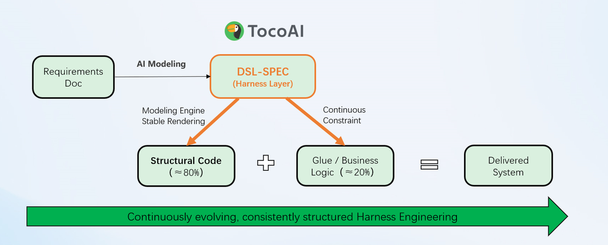

<div align="center">

**English** · [日本語](./README.ja-JP.md) · [简体中文](./README.zh-CN.md)


<h1>TocoAI：Server-side Harness Engineering based on DSL-Spec</h1>


[![][docs-shield]][docs-link]
[![][license-shield]][license-link]
[![][stack-shield]][stack-link]
[![][engine-shield]][engine-link]

<br/>

[![][github-stars-shield]][github-stars-link]
[![][github-issues-shield]][github-issues-link]
[![][github-contributors-shield]][github-contributors-link]


</div>

---

TocoAI is a **Harness Engineering** solution for server-side development. A Spec should not be a one-off artifact for code generation — it is the **structural control layer** of the system.

- Constrain LLM generation through **DSL-Spec**, keeping it continuously consistent with the code.

- Deterministically render structural code through the **Modeling Engine**, ensuring the codebase stays stable and drift-free.

Let AI always work under human design intent in server-side projects that require long-term iterative maintenance.

<video src="assets/toco-intro.mp4" controls width="100%"></video>

> [!TIP]
> Use Cursor to make it work. Use TocoAI to make it last.

<details>
<summary><kbd>Table of Contents</kbd></summary>

- [🚀 Quick Start](#-quick-start)
- [🏗️ Harness Engineering](#️-harness-engineering)
- [⚙️ Core Components](#️-core-components)
  - [📐 DSL-Spec](#-dsl-spec)
  - [🔧 Modeling Engine](#-modeling-engine)
  - [🧭 Human-in-the-Loop](#-human-in-loop)
- [⚖️ Comparison with Other Tools](#️-comparison-with-other-tools)
- [🎬 Demo Cases](#-demo-cases)
- [📋 Real Cases](#-real-cases)
- [🗺️ Applicable Scenarios & Limitations](#️-applicable-scenarios--limitations)
- [🤝 Community & Participation](#-community--participation)

</details>

---

## 🚀 Quick Start

- Install & Configure
  - [IntelliJ Plugin →][intellij-link]
  - [VS Code Plugin →][vscode-link]
- [DSL-Spec Syntax Reference →][dsl-docs-link]

---

## 🏗️ Harness Engineering

Server-side systems require long-term maintenance — they are more like constructing a building than 3D printing. We apply **architectural thinking** to build them:

- We need precise blueprints — so we defined a **DSL-Spec** aligned with DDD and CQRS
- With blueprints in place, we needed consistent and maintainable code structure — so we built the **Modeling Engine**, which deterministically renders structural code, accounting for roughly **80%** of a complex project
- Finally, inside a structurally sound building with all interfaces in place, we let AI handle the interior work — the if/else business logic that is hard to express in DSL-Spec

<div align="center">



</div>

---

## ⚙️ Core Components

### 📐 DSL-Spec

> *"The use of formal symbols is an extremely effective tool for excluding all sorts of nonsense. The 'naturalness' of natural language is precisely our ability to say things whose absurdity is not immediately obvious."*
>
> — Edsger Dijkstra, EWD667, 1978

Requirements and architecture design are expressed uniformly as a structured DSL-Spec, serving as the **Single Source of Truth** for the entire system. DSL-Spec is human-readable and machine-parseable. It is not a configuration file — **it is executable architectural intent**.

|  | Natural Language Spec | Programmatic IaC | **DSL-Spec** |
|--|:---------------------:|:----------------:|:------------:|
| **Clear meaning, readable** | Anyone can read it, but ambiguity only surfaces in production incidents | Precise, but requires understanding the execution flow to grasp intent | ✅ As readable as natural language, as precise as code — ambiguity is a compile error |
| **Clear details (What + How)** | Only vague What — How is left entirely to AI improvisation | Only How — architectural intent is buried in execution logic | ✅ What (data intent) and How (structural constraints) are both explicitly expressed |
| **Verifiable, maintainable** | Not machine-verifiable; changing a field requires manual impact tracking | Executable but no independent intent layer; change impact requires analysis tools | ✅ Machine-parseable and verifiable; change the DSL-Spec and the engine auto-cascades all affected structures |
| **Always consistent with code** | Accurate at launch, drifts in 3 months, becomes history in 6 | Code is the implementation, but architectural intent is lost over iterations | ✅ The relationship between Spec and code is always `=`, never `≈` |

<br/>

DSL-Spec covers the complete design hierarchy of server-side systems:

| Layer | Elements |
|-------|----------|
| **Domain Model** | Entity / Relation / Enum / EO (Value Object) |
| **Aggregate** | BO / Domain Events |
| **Data Transfer** | DTO / VO |
| **Query Plan** | ReadPlan |
| **Write Plan** | WritePlan (Based on BO) |
| **Flow Plan** | FuncFlow (task orchestration) / Message management |
| **Service Interface** | API / RPC / Service |

<br/>

A single DTO DSL-Spec definition auto-generates:

```
UserDetailDto.java                (~60 Lines)
UserDetailDtoManager.java         (~25 Lines)
UserDetailDtoManagerImpl.java
UserDetailDtoConverter.java       (~80 Lines)
UserDetailDtoService.java         (~70 Lines)
UserDetailDtoDataAssembler.java
```

[View full DSL-Spec syntax documentation →][dsl-docs-link]

<br/>

### 🔧 Modeling Engine

The engine covers generation of all structural code:

- Layered skeleton (`persist` / `manager` / `service` / `entrance`)
- Interface contracts and data models
- CQRS command/query separation
- Cross-layer converters (`DtoConverter` / `VoConverter`)
- Data assemblers (`DataAssembler`)
- Aggregate write chains (`BoService`)

**Developers only write the remaining 20% of business logic** — review costs drop by an order of magnitude.

> [!NOTE]
> The essence of the Modeling Engine is shifting quality control **left to "design time"** — deterministically rendering the code framework defined by the DSL-Spec. Structural code is generated by the engine, not by an LLM on each iteration. This fundamentally eliminates AI's random errors and architectural drift. No matter how many iterations or how many team members, the foundational structure always stays consistent with the design.

> [!IMPORTANT]
> The engine is planned to be **open-sourced in the second half of 2026**.

<br/>

### 🧭 Human-in-the-Loop

AI is not omniscient. For decisions with long-term impact — domain boundaries, data structure definitions, interface descriptions, read/write plans (transaction constraints, operation performance) — we provide a standard approach combining AI-assisted modification with manual control.

**Keep AI as the assistant, not the decision-maker.**

---

## ⚖️ Comparison with Other Tools

Cursor and Claude Code are excellent general-purpose coding assistants — in fact, TocoAI uses them internally to implement business logic. We solve problems at a different level.

> [!NOTE]
> TocoAI is designed for: **relational database-driven server-side systems that require long-term iteration and multi-person collaboration**. If you are building a prototype, a script tool, or a frontend project, Cursor is enough.

|  | Cursor / Claude Code | TocoAI |
|--|:--------------------:|:------:|
| **Role** | General-purpose conversational coding assistant | Server-side engineering Harness, structured solution for specific scenarios |
| **Code origin** | LLM generates based on prompt | DSL-Spec → engine deterministic generation (80%) + LLM for business logic |
| **Architectural consistency** | Maintained via prompt and review | Guaranteed by DSL-Spec + engine, no human dependency |
| **Best fit** | Rapid prototyping, ad-hoc coding | Complex business systems requiring long-term maintenance |
| **Team scale** | Best for individuals or small teams | The larger the team and the longer the iteration, the greater the advantage |
| **Learning curve** | Almost none | Requires understanding DSL-Spec and modeling approach |

---

## 🎬 Demo Cases

### BnB Short-term Rental Platform

A complete short-term rental platform covering property management, shopping cart, order settlement, inventory validation, and membership points — demonstrating TocoAI's end-to-end workflow from requirements to delivery.

**Business coverage:** Room inventory &nbsp;·&nbsp; Cart &nbsp;·&nbsp; Orders / Sub-orders &nbsp;·&nbsp; Payment &nbsp;·&nbsp; Points deduction &nbsp;·&nbsp; Consumption records

[View full demo →][bnb-demo-link]

---

## 📋 Real Cases

### Large Hospital HIS System

**Background:** Next-generation hospital-wide management system, 120+ core modules, 200+ business processes, multi-team parallel development.

**Challenge:** Zero tolerance for errors in medical business; multi-person cross-time collaboration easily produces logic gaps and technical debt.

**Result:** Architecture standards enforced consistently; generated code accuracy significantly improved; overall project AI code adoption rate near **97%**; new team members can quickly understand the full project during handover.

[View case details →][case-his-link]

<br/>

### Financial Margin Payment System Refactor

**Background:** Refactoring a legacy margin payment system, originally built on SQLServer 2008 + stored procedures + multiple third-party middlewares.

**Challenge:** Business processes scattered; data and business relationships unclear; significant performance bottlenecks.

**Result:** Re-modeled via DSL-Spec, making business relationships explicit; end-to-end flows traceable; system can continue iterating under the TocoAI framework.

[View case details →][case-finance-link]

---

## 🗺️ Applicable Scenarios & Limitations

All DSLs are **domain-specific**. They are only valid within a specific domain — there is no universal DSL that covers everything; forcing universality leads to reinventing a programming language. TocoAI's DSL-Spec only describes relational database-driven server-side systems. This is an intentional boundary, not a capability limitation.

Even within a single domain, DSL-Spec is not meant to replace programming code. Our boundary is **DSL-Spec-ifying information that is suitable for structured description** — the rest of the business logic is left to programming languages and AI.

**Legacy project compatibility:** New modules can be developed in legacy projects, but taking over all existing legacy code is out of scope. The right path is to handle new requirements with new modules and gradually migrate old logic into the DSL-Spec governed scope — **refactoring is daily work in the AI era**.

The Harness Engineering approach itself is universal. We look forward to other teams extending it in their own domains — embedded systems, frontend components, infrastructure configuration — all can benefit from their own DSL-Spec.

---

## 🤝 Community & Participation

- Visit [tocoai.dev][docs-link] for full documentation
- Join the [Discord community][discord-link] to ask questions, discuss features, and share practices
- Submit bug reports or feature suggestions on [GitHub Issues][github-issues-link]
- The Modeling Engine is planned to open-source in **H2 2026** — star the repo to stay updated

No technology is perfect; there are only scenarios it fits. After all, AI has only been changing software development for one year — but software development itself has a history of seventy or eighty years.

[Contributing Guide →](CONTRIBUTING.md)

---

<div align="center">

Copyright © 2025 TocoAI. Released under the [Apache 2.0][license-link] License.

</div>

<!-- LINK GROUP -->
[docs-shield]: https://img.shields.io/badge/Docs-tocoai.dev-brightgreen?style=flat-square&color=73DC8C&labelColor=black
[docs-link]: https://tocoai.dev/en/docs

[license-shield]: https://img.shields.io/badge/License-Apache_2.0-blue?style=flat-square&color=4B78E6&labelColor=black
[license-link]: LICENSE

[stack-shield]: https://img.shields.io/badge/Stack-Java_|_Spring_Boot-orange?style=flat-square&color=ffcb47&labelColor=black
[stack-link]: https://tocoai.cn

[engine-shield]: https://img.shields.io/badge/Engine_OSS-H2_2026-pink?style=flat-square&color=FA9BFA&labelColor=black
[engine-link]: https://tocoai.cn/docs/engine

[github-stars-shield]: https://img.shields.io/github/stars/tocoai/toco?style=flat-square&color=ffcb47&labelColor=black&logo=github
[github-stars-link]: https://github.com/tocoai/toco/stargazers

[github-issues-shield]: https://img.shields.io/github/issues/tocoai/toco?style=flat-square&color=ff80eb&labelColor=black&logo=github
[github-issues-link]: https://github.com/tocoai/toco/issues

[github-contributors-shield]: https://img.shields.io/github/contributors/tocoai/toco?style=flat-square&color=c4f042&labelColor=black&logo=github
[github-contributors-link]: https://github.com/tocoai/toco/graphs/contributors

[intellij-link]: https://tocoai.dev/en/docs/installation
[vscode-link]: https://tocoai.dev/en/docs/installation-vscode
[dsl-docs-link]: ./dsl.md
[engine-docs-link]: https://tocoai.cn/docs/engine
[bnb-demo-link]: https://tocoai.cn/docs/your-first-toco-project
[case-his-link]: https://tocoai.cn/cases/his
[case-finance-link]: https://tocoai.cn/cases/finance
[discord-link]: https://tocoai.cn/discord
